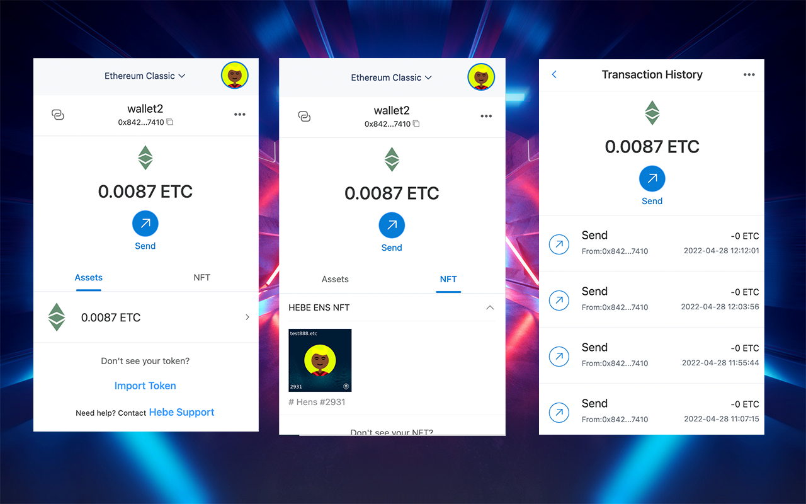

# etcwallet-extension

https://chrome.google.com/webstore/detail/etcwallet/dceeepfcmoilomeofhafoggbaokjdlco/related?hl=en&authuser=0

Etc Wallet enables you to securely store, send, and receive Etc cryptocurrency, as well as any tokens built on the EthereumClassic  Token Platform including NFTs and fungibles.

Etc Wallet supports users to add any evm chain network, the current transaction record data is taken from the api of blockscout.

This non-custodial web 3.0 wallet enables you to interact with EthereumClassic dapps in a secure way. It provides you the ability to authenticate and sign transactions without exposing your private keys. Your keys are kept secure in the extension’s storage area and are encrypted with a password.

This crypto wallet extension requires and requests your express permission in order to interact with any webpage or dapp you visit, because it adds new functionality to the normal browser context.

Etc Wallet is convenient for dapp developers to develop, and the window.ethereum of matemask is integrated by default, so that developers do not need to learn new methods

If you think our development is good, please sponsor us to continue to develop: 0x4a5067a98FF03822BC7979b54FC0D8Fc8036CbeE

Etc Wallet supports ETC domain name system: Hens, .etc transfer and Hens avatar display, register Etc domain name system: https://app.hens.domains

Issues that need to be fixed:

1.Sending calculation gas error, resulting in unable to obtain correct gas
